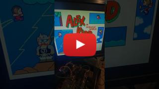

# RGBlast SMS - RGB + Audio To HDMI For Sega Master System

Work in progress! 

## Description

The original RGBlast project was a 2-bit flash analog-to-digital converter RP2040-based video capture for the Sega Mega-Drive/Genesis... which is ideal for capturing the RGB222 video signals from the Sega Master System!

## Features

- RGB222 Video Capture
- Mono Audio Capture
- HDMI output using [ikjordan PicoDVI fork](https://github.com/ikjordan/picodvi)

## To-Do

- Update schematics
- Fix wobbly vertical lines
- 50/60hz switch?
- Design PCB
- ???

## Demo Video

----
----

Original Readme:

# SEGA Genesis RGBlast Processor - RP2040 code & Schematics

A hardware design for capturing RGB direct from a SEGA Genesis and delivering it via USB to a PC.

## Description

The SEGA Genesis RGBlast Processor is a Raspi Pico based video capture device that directly digitizes the RGB output of a SEGA Genesis and delivers it via USB to a host computer.

The analog channels (RGB) are captured via a 2 bit Flash ADC which is half hardware and half PIO program.

To build a functioning version from scratch, please see the circuit-schematics folder. PCB Schematics will be released if/when a proven design is achieved. Here is one of the latest prototypes as built from the schematic:

At the moment this device is capable of 6 bits per pixel, ~30FPS. Video is fairly noisy in the test PCBs which have been constructed:

https://user-images.githubusercontent.com/127321359/224463316-a748747a-c26d-4245-b84a-755739763bbe.mp4

## Getting Started

Building this to a Raspi Pico requires the C/C++ SDK: https://www.raspberrypi.com/documentation/microcontrollers/c_sdk.html

It is possible to test this device with more commonly available parts. For example utilizing LM393s as comparators (rather than the MCP6569) on a breadboard will work, but the image will be very noisy/sloppy.

You could also utilize the Raspi Pico's built-in USB (instead of the FTDI external device.) Framerates will be significantly lower.

Please see the Rust client project for the software which can receive and decode the incoming 6bpp stream to a simple application window.

## Authors

Contributors names and contact info

JP Stringham
[@jotapeh](https://mastodon.gamedev.place/@jotapeh)

## Version History

* 0.1
    * Initial Release

## License

This project is licensed under the MIT License - see the LICENSE file for details
